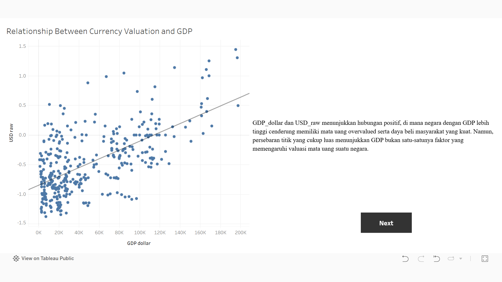
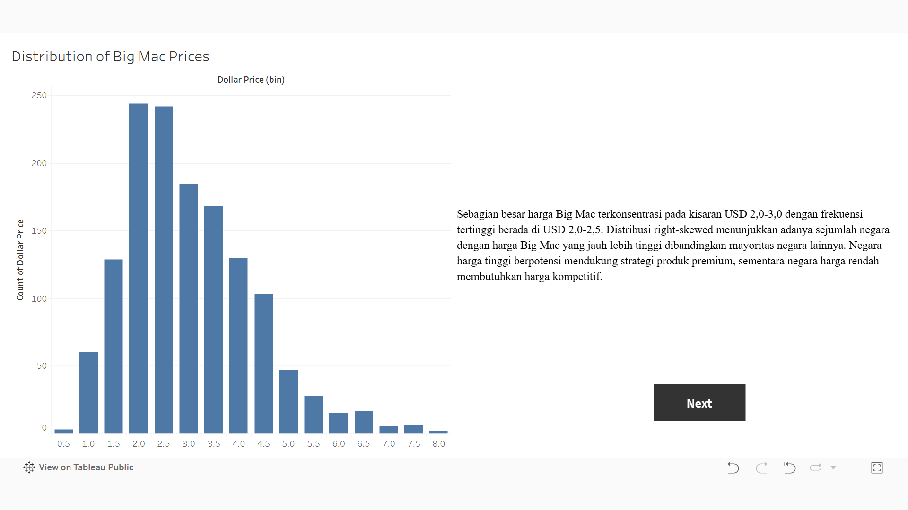
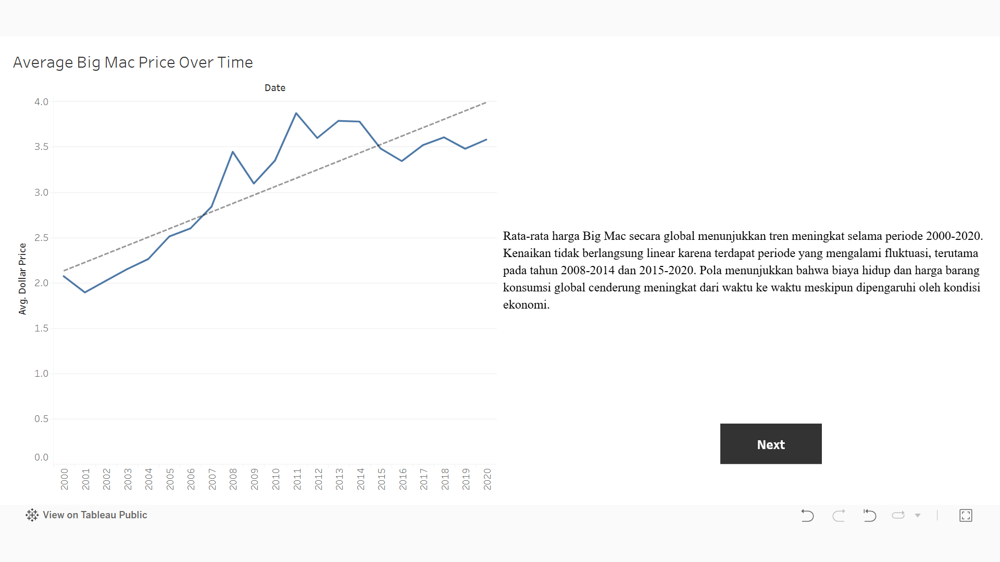

# End-to-End Data Analysis Project: Big Mac Index for International Market Analysis

I recently completed a data analysis project exploring global purchasing power, currency valuation, and international market opportunities using the Big Mac Index.

Author:
Nadine Putri Larasati

LinkedIn:
https://www.linkedin.com/in/nadine-putri-larasati-847214395/

## Business Questions:

- Which countries have the most overvalued and undervalued currencies based on the Big Mac Index, and how can these insights support international pricing strategies?
- How does the relationship between local Big Mac prices and dollar prices reflect purchasing power across countries?
- How do actual exchange rates compare with Purchasing Power Parity (PPP), and which countries offer the most attractive market opportunities?
- How have Big Mac prices been distributed across countries and evolved over time, and what do these trends reveal about global cost of living and consumer purchasing power?

## What I Did:

- Data Wrangling (Gathering, Assessing, Cleaning)
- Missing value imputation using median
- Exploratory Data Analysis (EDA)
- Descriptive Statistics (Skewness, Central Tendency)
- Statistical comparison of outlier detection methods (Z-Score vs Tukey's Rule)
- Outlier analysis using Tukey's Rule (IQR)
- Inferential Statistics using Kruskal-Wallis Test
- Business interpretation and international pricing strategy recommendations
- Deployed to Tableau Public

## Key Insights:

- Countries with overvalued currencies generally have stronger purchasing power but higher operational costs, while undervalued countries offer cost-efficiency advantages for production and international expansion. However, businesses must also consider macroeconomic risks such as inflation and currency volatility.
- Local product prices showed almost no linear relationship with dollar prices, indicating that exchange rates and Purchasing Power Parity (PPP) play a much larger role than nominal local prices in determining international purchasing power. Significant gaps between actual exchange rates and PPP in countries such as Colombia, Chile, and Costa Rica highlight both business opportunities and exchange-rate risks. Additionally, Big Mac prices remained concentrated around USD 2.3–2.5 globally, while long-term price trends reflected the impact of inflation and changing global economic conditions, emphasizing the need for adaptive pricing strategies.

## Tools:

Python, Matplotlib, NumPy, Pandas, SciPy, Seaborn, Tableau, Git, and GitHub.

## Dashboard:

https://public.tableau.com/views/big_mac_dashboard/ObjectiveAnalysis1?:language=en-US&publish=yes&:sid=&:redirect=auth&:display_count=n&:origin=viz_share_link

## Dashboard Preview

## AI Attribution/Acknowledgements

Ideas and Concepts: I utilized ChatGPT to brainstorm necessary features based on the business context of my project, specifically using the E-Commerce Public Dataset.

Syntax and Debugging: I utilized ChatGPT to refine and debug my code, ensuring all scripts were properly adjusted to align with standard Python syntax.

Interpretation: I utilized ChatGPT to better understand the dataset through a business lens, which helped me identify key insights during the data analysis process.

Note: All code has been personally tested and modified.
